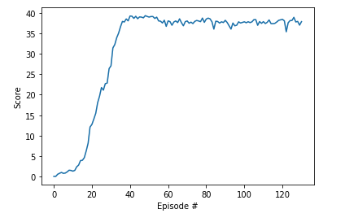

# Project Report: Continuous Control

## Introduction
The goal of this project was to implement an agent that would learn a control policy to solve Unity's "Reacher" Environment. The Reacher environment consisted of twenty double-jointed arms (reachers) with the goal to maintain the end (or hand) of each reacher at a target position for as many time steps as possible.  Each agent was awarded 0.1 for each time step the reacher's hand was in the target location.  The environment was considered solved if the agent could achieve an average score of 30 or more across the twenty reachers for 100 consecutive episodic tasks.

## Solution
I used the [DDPG](https://arxiv.org/abs/1509.02971) (Deep Deterministic Policy Gradient) architecture and learning algorithm to solve this environment.  DDPG was chosen for several reasons.  First, DDPG can learn continuous action spaces, unlike DQN which works well with discrete action spaces.  Second, DDPG has an Actor-Critic architecture, where the Actor learns the policy mapping states to actions, and the Critic learns the Action-Value function estimating the value of a particular state/action combination.  This estimate is used in computing the Actor's loss.  

### Architecture and Learning Algorithm
The Actor network maps states to actions.  This is implemented with a four layer neural network: one input layer, two hidden layers, both with ReLU activation functions, and a four node output layer with a tanh activation function.  The Actor's goal is to maximize the value of the action (max Action-Value).

We use the Critic to estimate the Action-Value function, Q(s,a), for the Actor to use during it's learning.  Our Critic is also a four layer neural network with one input layer, two hidden layers with ReLU activation functions, and a single linear output.  The Critic's goal is to minimize the difference between the true Q(s,a) function and it's estimate.  Of course, we don't know the true Q(s,a) function, so we estimate it using temporal differencing and call it the TD_target.  We call our model's output the TD_local.  We want to minimize the difference (MSE) between the TD_target and TD_local.

To decorrelate our estimate TD_target from the TD_local, DDPG employs several techniques.  First, we create a copy of both the Critic and Actor networks, called critic_target and actor_target respectively.  The weights of both target networks are updated using a soft-update mechanism, so they move more slowly than the weights of the "local" Actor and Critic.  This helps to decorrelate our estimate of Q(s,a).

In order to update our Critic network, we first get off-policy actions using our actor_target network.  We then use these off-policy actions in the critic_target network to compute estimates for Q(s',a').  Using our received rewards, we can compute our estimate of Q(s,a) = R + gamma * Q(s',a').  This estimate is used to compute and optimize the loss for our Critic.  Using off-policy actions from the action_target network further helps convergence.  

To encourage exploration of the action space, we add noise to the actions using a Ornstein-Uhlenbeck process, controlled by hyperparameters mu, theta, and sigma.

Finally, we update the Actor network by computing the value of it's actions using the current Actor and Critic networks (ie actor_local and critic_local).  As with the critic_target, we update the actor_target using soft weight updates that change more slowly than the Actor itself (actor_local).  The soft updates are controlled by a hyperparameter, Tau.

For training, we use mini-batches that sample from a replay buffer, to minimize any correlations between samples in the minibatch.  The size of the replay buffer and minibatches are controlled by hyperparameters.

### Chosen Hyperparameters
**Actor Networks** (actor_local, actor_target)
+ **Input Layer**: 33 nodes (the state space size)
+ **Hidden Layer 1**: 300 nodes with a ReLU activation function and Glorot weight init
+ **Hidden Layer 2**: 200 nodes with a ReLU activation function and Glorot weight init
+ **Output Layer**: 4 nodes (the action space size) with a Tanh activation function
+ **Optimizer**: Adam

**Critic Networks** (critic_local, critic_target)
+ **Input Layer**: 33 nodes (the state space size)
+ **Hidden Layer 1**: 300 nodes with a ReLU activation function concat with 4 action nodes, and Glorot weight init
+ **Hidden Layer 2**: 200 nodes with a ReLU activation function and Glorot weight init
+ **Output Layer**: 1 node
+ **Optimizer**: Adam

**Other Hyperparameters**
+ **Actor Learning Rate**: 1e-4
+ **Critic Learning Rate**: 1e-4
+ **OU Noise** (actions): mu=0, theta=0.15, sigma=0.25
+ **Replay Buffer Size**: 1e5
+ **Batch Size**: 128
+ **Tau** (soft update): 1e-3
+ **Gamma** (discount rate): 0.99

## Results
Using the 20 reachers in parallel, the environment was solved in 35 minutes on my laptop's CPU, requiring 131 episodes with a final average score of 37.86

Figure 1 shows the plot of episode number vs average score.  Additionally, I printed out variance of the scores within the score window (the last 100 episodes) to further watch convergence as the agent trained.  As expected, the variance in the scores dropped dramatically as the learning process neared completion.

Figure 1: Scores vs Episode During Learning

STARTING RUN: id 2746317214 
Episode 5	Average Score: 1.02	Score Variance: 0.15 
Episode 10	Average Score: 1.50	Score Variance: 0.24 
Episode 15	Average Score: 3.92	Score Variance: 0.99 
Episode 20	Average Score: 12.11	Score Variance: 8.92 
Episode 25	Average Score: 19.66	Score Variance: 36.40 
Episode 30	Average Score: 26.37	Score Variance: 73.62 
Episode 35	Average Score: 35.06	Score Variance: 132.44 
Episode 40	Average Score: 38.05	Score Variance: 190.19 
Episode 45	Average Score: 38.57	Score Variance: 225.91 
Episode 50	Average Score: 39.12	Score Variance: 244.56 
Episode 55	Average Score: 38.95	Score Variance: 252.72 
Episode 60	Average Score: 36.70	Score Variance: 251.64 
Episode 65	Average Score: 38.02	Score Variance: 247.99 
Episode 70	Average Score: 37.85	Score Variance: 242.71 
Episode 75	Average Score: 37.93	Score Variance: 236.60 
Episode 80	Average Score: 37.68	Score Variance: 230.61 
Episode 85	Average Score: 36.03	Score Variance: 224.19 
Episode 90	Average Score: 37.64	Score Variance: 217.52 
Episode 95	Average Score: 37.51	Score Variance: 210.49 
Episode 100	Average Score: 37.67	Score Variance: 203.84 
Episode 105	Average Score: 37.81	Score Variance: 164.32 
Episode 110	Average Score: 37.44	Score Variance: 120.06 
Episode 115	Average Score: 37.37	Score Variance: 72.976 
Episode 120	Average Score: 38.30	Score Variance: 33.76 
Episode 125	Average Score: 38.11	Score Variance: 12.89 
Episode 130	Average Score: 37.01	Score Variance: 2.570 
Episode 131	Average Score: 37.86	Score Variance: 1.45 

Environment solved in 131 episodes!	Average Score: 37.86	Score Variance: 1.45 

Saving model params as: final_2746317214_checkpoint_actor.pth and final_2746317214_checkpoint_critic.pth 
total train time:  2093.6735937595367 seconds

## Ideas for Future Work
1. **Prioritized Experience Reply** - weight samples in the replay buffer by their effect on the weight updates.
2. **Soft Actor Critic (SAC)** - an approach to maximizing entropy as well as maximizing expected return may improve (or make more robust) the convergence in learning.  Ref: [Haarnoja et al](https://proceedings.mlr.press/v80/haarnoja18b/haarnoja18b.pdf)
3. **Twin Delayed Deep Deterministic policy gradient (TD3)** - a variance reduction technique that potentially improves the overestimation bias in actor-critic networks, such as DDPG.  Ref: [Fujimoto et al](https://proceedings.mlr.press/v80/fujimoto18a/fujimoto18a.pdf)

## Attributions
This code was based off starter code provided in the DDPG Pendulum example in the [Udacity deep-reinforcement-learning repo](https://github.com/udacity/deep-reinforcement-learning/tree/master/ddpg-pendulum)
